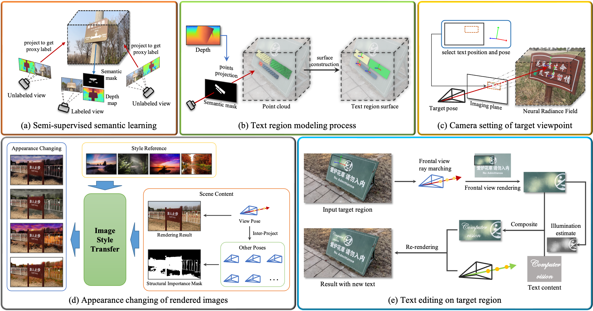

# TextNeRF: A Novel Scene-Text Image Synthesis Method based on Neural Radiance Fields
 This repository accompanies the CVPR2024 paper "__TextNeRF: A Novel Scene-Text Image Synthesis Method based on Neural Radiance Fields__".
 

# Abstract
Acquiring large-scale, well-annotated datasets is essential for training robust scene text detectors, yet the process is often resource-intensive and time-consuming. While some efforts have been made to explore the synthesis of scene text images, a notable gap remains between synthetic and authentic data. In this paper, we introduce a novel method that utilizes Neural Radiance Fields (NeRF) to model real-world scenes and emulate the data collection process by rendering images from diverse camera perspectives, enriching the variability and realism of the synthesized data. A semi-supervised learning framework is proposed to categorize semantic regions within 3D scenes, ensuring consistent labeling of text regions across various viewpoints. Our method also models the pose, and view-dependent appearance of text regions, thereby offering precise control over camera poses and significantly improving the realism of text insertion and editing within scenes. Employing our technique on real-world scenes has led to the creation of a novel scene text image dataset. Compared to other existing benchmarks, the proposed dataset is distinctive in providing not only standard annotations such as bounding boxes and transcriptions but also the information of 3D pose attributes for text regions, enabling a more detailed evaluation of the robustness of text detection algorithms. Through extensive experiments, we demonstrate the effectiveness of our proposed method in enhancing the performance of scene text detectors.

# Data
We collected a total of 438 real scenes and synthesized a dataset using our method. 
This data can be downloaded from [Google Drive](https://drive.google.com/drive/folders/1mp60VcXW3cylIuZvRI4U1NBzANFmCclO?usp=drive_link)

## Data Formats
The unzipped dataset has the format shown below:
```sh
|- TextNeRF_dataset
|    |- scene_0000
|    |    |- images
|    |    |    |- 000.jpg
|    |    |    |- 001.jpg
|    |    |    |- 002.jpg
|    |    |    |- ...
|    |    |- Label.txt
|    |    |- meta.json
|    |- scene_0001
|    |    |- images
|    |    |    |- 000.jpg
|    |    |    |- 001.jpg
|    |    |    |- 002.jpg
|    |    |    |- ...
|    |    |- Label.txt
|    |    |- meta.json
|    |- scene_0002
|    |    |- images
|    |    |    |- 000.jpg
|    |    |    |- 001.jpg
|    |    |    |- 002.jpg
|    |    |    |- ...
|    |    |- Label.txt
|    |    |- meta.json
|    |...
```

## Annotations
For each scene, the synthesized image results are in the "__images__" folder, and the text annotation content corresponding to each image is in the "__Label.txt__" file. 

For the "__Label.txt__" file, each line is the annotation information about one image, which contains two parts:

```py
# image_path   \t   json-string (a list of dict, which can be loaded by json.loads() function)
images/xxx.jpg    [{"transcription": ..., "points": ..., "text_pose": ...}, ...]
images/xxx.jpg    [{"transcription": ..., "points": ..., "text_pose": ...}, ...]
images/xxx.jpg    [{"transcription": ..., "points": ..., "text_pose": ...}, ...]
...
```

## MetaData
In addition, we also provide some basic information for the images of each scene in the "__meta.json__" file, including the image size, the intrinsics and extrinsics of each rendering camera, and whether the image is stylized.
```py
{
   "images/xxx.jpg": {
        "intrinsic": ...,
        "image_wh": ...,
        "pose": ...,
        "style": ...
    },
    "images/xxx.jpg": {
        "intrinsic": ...,
        "image_wh": ...,
        "pose": ...,
        "style": ...
    },
    ...
}
```

# Method Overview
__Some important components of our method__. Based on NeRF's high-quality modeling of the scenes, we respectively implement (a) semi-supervised semantic learning across multi-views, (b) modeling text regions, (c) controllable camera setting for rendering target viewpoint, (d) changing the appearance of rendered images, and (e) photo-realistic text editing on target region.



# Code
coming soon...
